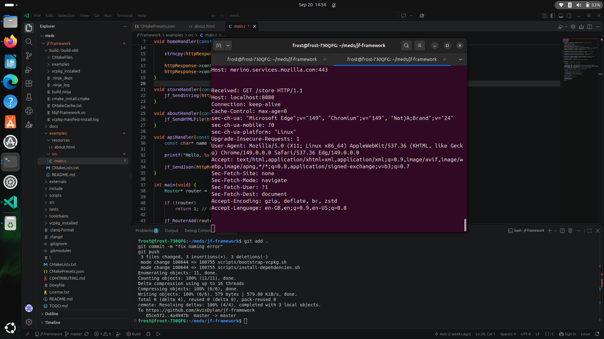

# JF Framework

### License

JF Framework is licensed under [GPLv3](./License.txt)
### Description
JF Framework is a web framework coded in C as a school project. **NOTE** this project uses UNIX sockets and won't work on Windows.

### Example

*Image by RootX*

### Progress
A roadmap can be found in the [TODO](./TODO.md).

### Dependencies
- [OpenSSL](https://www.openssl.org/): Used for TLS

### Contributing
Please read the [CONTRIBUTING](./CONTRIBUTING.md) before making pull requests.

### Documentation
Full documentation is found in the Doxygen generated site [Docs](https://avisdylan.github.io/jf-framework/html/). You can also find an example in [example](./examples/)

### How to build
#### On both architectures run first:
1. [Bootstrap VCPKG](./scripts/bootstrap-vcpkg.sh)
2. [Install dependencies](./scripts/install-dependencies.sh)

#### To build on amd64 you must run:
1. `cmake --preset build-x86 -S .`
2. `cmake --build --preset build-x86`

#### To build on arm64 you must run:
1. `cmake --preset build-arm -S .`
2. `cmake --build --preset build-arm`

**Alternativaly you can run the scripts found in [scripts](./scripts/)**
